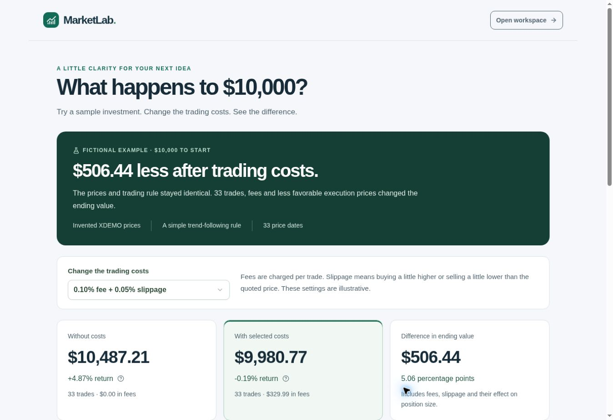
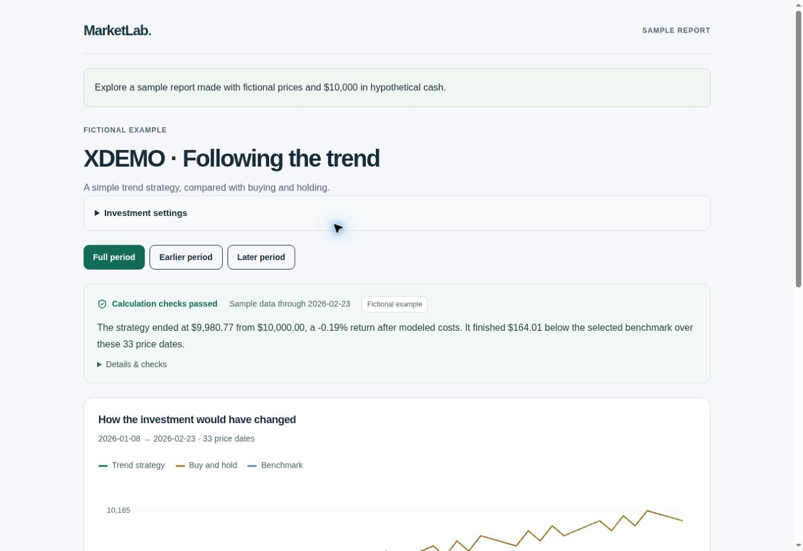
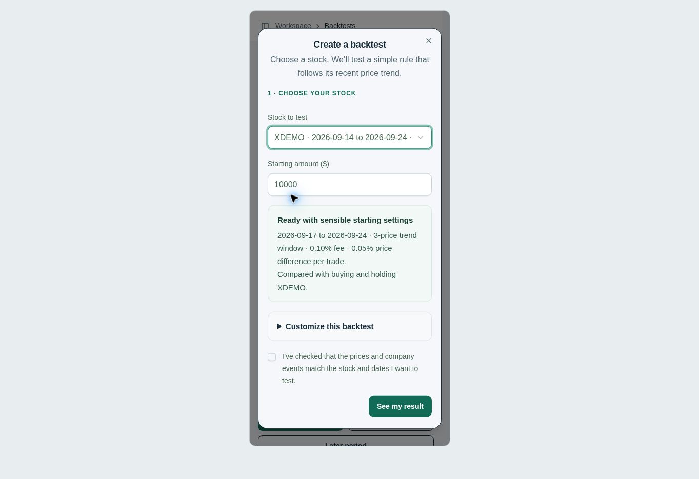
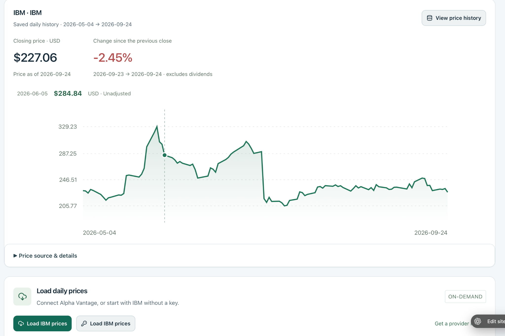
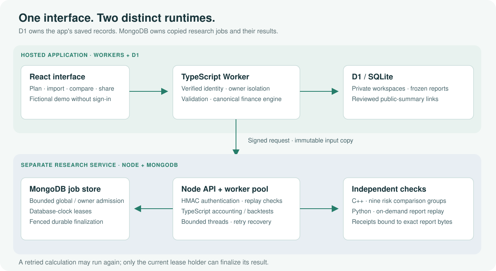

# MarketLab

Portfolio planning and reproducible research, with the inputs and accounting behind every result kept inspectable.

**TypeScript · React · Workers / D1 · Node.js / MongoDB · C++ · Python**

[Open the app](https://marketlab-portfolio.michaelbaffour240306.chatgpt.site) · [Try a fictional report](https://marketlab-portfolio.michaelbaffour240306.chatgpt.site/example) · [Engineering notes](docs/engineering-roadmap.md) · [Test guide](tests/README.md)



The welcome screen gives you a result before asking for an account: change the costs on the same fictional investment and see what changes. From there, create a private workspace, review an imported portfolio, or run a saved research experiment.

The welcome image and the two short-tour screenshots below use local browser fixtures with fictional data. Those three captures show implemented screens; they are not real customer portfolios or evidence of production adoption.

## A short tour

| Start with | What you can do |
| --- | --- |
| **My plan** | Combine manually entered accounts and debts, track a goal, inspect fee projections, and compare contribution or stress scenarios. |
| **Your data** | Validate historical CSVs or fetch Alpha Vantage daily closes, then save source-labeled, immutable price snapshots. A Schwab transaction adapter retains a conversion and reconciliation receipt. |
| **Research lab** | Compare a next-close trend rule with buying and holding, model fees and slippage, inspect earlier/later periods, and save the full inputs and results. |
| **Reports** | Read plain-language takeaways and calculation checks, download JSON/CSV, request independent replay, and explicitly publish a redacted summary. |
| **Discussions** | Invite an account to comment on a shared report, then revoke access without exposing the private workspace. |

Manual account aggregation is implemented. Bank connections, brokerage execution, and automatic account refresh are not.

| A report you can inspect | A backtest with sensible defaults |
| --- | --- |
|  |  |

## Stock data pipelines

Explore a stock's saved daily closes as a chart, with its coverage dates, currency, adjustment basis, and change from the previous close visible. Load Alpha Vantage prices on demand or import historical CSVs to work with your own recorded data.



*User-provided capture of MarketLab's saved IBM history, May 4–September 24, 2026. It shows historical closing prices rather than a live quote.*

Three ingestion paths converge on the same private price-snapshot model:

| Input path | What crosses the boundary | Implementation |
| --- | --- | --- |
| **Alpha Vantage through the server** | A bounded daily-close response, fetched with the IBM demo key or a configured server secret. Provider notices stop the import instead of becoming prices. | [Provider route](app/api/provider/route.ts) · [Response normalizer](lib/finance/provider.ts) |
| **Alpha Vantage from the browser** | A one-time key goes directly to the provider. Only normalized prices and provider metadata return to MarketLab, where the server validates them again. | [Browser client](lib/finance/browser-provider.ts) · [Reservation and save route](app/api/provider/browser/route.ts) |
| **Historical CSV** | One symbol's dated USD prices, an explicit source, adjustment basis, and historical/synthetic declaration. Invalid dates, duplicate observations, and malformed quoting fail validation. | [CSV validator](lib/finance/market-data.ts) · [Dataset route](app/api/datasets/route.ts) |


Validated observations become **immutable, owner-scoped D1 snapshots**. Their SHA-256 identity includes precision-preserving values and declared metadata; provider snapshots additionally bind origin, refresh date, and timezone. Saving identical inputs reuses the existing snapshot. `csv`, `alphavantage`, and `alphavantage-browser` remain distinct in storage and exports. [Snapshot persistence](lib/datasets.ts).

Research binds those snapshots to complete declared split/dividend records, computes exact accounting and next-close backtests, then checks the preview fingerprint before saving frozen inputs and outputs. Separately, imported portfolio ledgers bind to saved prices for exact cash/share accounting and cash-flow-matched comparisons. [Saved research](app/api/research/route.ts) · [Portfolio accounting](lib/finance/historical-portfolio.ts).

**Verification and sharing are separate branches.** A saved backtest can be copied into bounded, signed Node/MongoDB jobs for fenced recomputation and C++ risk checks, or sent to independent Python replay for a receipt bound to the exact report. Reviewed sharing publishes only an allowlisted, expiring, revocable summary. It does not require either verification action; the redacted summary cannot replay withheld raw prices. [Background jobs](app/api/research/jobs/route.ts) · [Replay receipts](lib/research-replay.ts) · [Redaction](lib/finance/shared-research.ts).

These are user-triggered historical-data paths, not a streaming feed. Provider paths share one atomic per-account cooldown and do not retry provider requests automatically. A validated browser import is not server-authenticated market data; source coverage and adjustment assumptions stay visible. [Cooldown](lib/provider-runs.ts) · [Editable diagram](docs/media/stock-data-pipeline.svg).

## Why the results are reproducible

### Exact money, explicit execution

The [accounting engine](lib/finance/core.ts) uses `BigInt` cents and millionths of shares. Split fractions remain exact in the research engine. Monetary rounding is explicit; floating-point numbers are reserved for display and dimensionless statistics. Historical validation rejects overdrafts and short positions.

Research signals use information available at an observation and execute at the **next supplied close**. Costs, dividends, splits, starting cash, missing prices, and evaluation dates have defined rules. Deposits and withdrawals are excluded from the portfolio's time-weighted return.

[Accounting conventions](docs/reference-guide.md#accounting-conventions) · [Runnable money examples](docs/money-arithmetic.md) · [Research methodology](docs/reference-guide.md#research-lab)

### Frozen inputs, separate evidence

Saved experiments contain the settings, method version, complete price/event inputs, outputs, and a SHA-256 identity. Changed inputs produce a different identity. A report's internal checks are distinct from its independent verification status.

The [Python verifier](verification/python/verify_research.py) independently replays accounting, signals, trades, risk metrics, and fingerprints. The service validates replay receipts against the **exact report bytes**. C++ separately checks nine risk comparison groups during native-verifying research jobs.

A passing consistency check does not authenticate imported prices or predict future performance. Browser-imported Alpha Vantage data retains separate provenance because the server cannot authenticate that transfer directly.

[Report checks](docs/confidence-certificates.md) · [Independent replay](docs/independent-replay.md) · [Verifier](verification/python/README.md)

### Recovery with a bounded queue

Research submissions have signed ownership, nonce replay protection, and database-enforced global/per-owner active limits. MongoDB-clock leases and lease tokens fence heartbeats and finalization. A crashed calculation may run again; a stale worker cannot replace the current worker's durable result.

The crash fixture kills a real runner after calculation and before saving, waits for natural lease expiry, and starts competing replacements. Fixed-arrival measurements separately exercise overload, rejection, and recovery.

[Lease-race and crash evidence](docs/reliability-evidence.md) · [Admission and overload](docs/overload-handling.md) · [Store implementation](services/research/store.ts)

## Runtime boundaries



The hosted app uses **Workers + D1**. Its saved workspaces and reports remain authoritative in D1. A separate **Node / MongoDB research service**, verified on Railway staging, owns copied research inputs, background jobs, and their results. C++ is a Node-API addon; Python is an independent, bounded replay process. The website has not been migrated to MongoDB.

[Diagram source](docs/media/architecture.svg) · [Architecture notes](docs/architecture-roadmap.md) · [Service setup](docs/research-service.md) · [Staging evidence](docs/research-staging.md)

## Measured service workload

Three local runs completed **3,000 verified jobs** with zero failures. The combined measurements were:

| Metric | Result | Scope |
| --- | ---: | --- |
| Verified throughput | **39.96 jobs/s** | 3 × 1,000 jobs; warm-up excluded |
| Client-observed p99 | **319.77 ms** | Combined raw samples; signing through validated result retrieval |
| Calculation workers / clients | **2 / 8** | Closed-loop clients, one job in flight per client |
| Inputs per job | **500 observations per instrument** | Two fictional instruments; native risk checks enabled |

The service, load driver, and standalone MongoDB ran on the same Linux machine with Node 24.19.0 and MongoDB 8.0.17. Timings include HTTP, queueing, computation, storage, polling, and client checks. They exclude process startup and the Workers/D1 gateway. These are **local workload measurements**, not production capacity, live-site latency, or an open-loop SLO.

[Full methodology and environment](docs/service-performance.md) · [Raw report](docs/evidence/service-load-2026-09-26/report.json) · [Separate fixed-arrival results](docs/overload-handling.md)

## Run locally

Use **Node 24** and **pnpm 11.25.0** for the full engineering gate. Core unit checks do not require an API key or a paid provider account.

```sh
pnpm install --frozen-lockfile
pnpm test
pnpm typecheck
pnpm lint
```

A clean clone selects the portable development profile. Run:

```sh
pnpm build
# Apply each pending drizzle/*.sql migration in filename order, once.
node --import ./scripts/sites-env.mjs ./node_modules/wrangler/bin/wrangler.js \
  d1 execute DB --local --config dist/server/wrangler.json \
  --persist-to .wrangler/state --file drizzle/0000_demonic_nightmare.sql
# Repeat the migration command with each subsequent pending SQL filename.
pnpm dev
```

Open `http://localhost:5173`. Portable development includes a loopback-only mock sign-in for fictional local workspaces; this is not the hosted identity provider. Managed Sites previews use their supervised preview command instead. See [runtime setup](docs/runtime.md) and [the local sign-in implementation](build/sites-vite-plugin.ts).

The first-run example and authored practice portfolio need no market-data key. Alpha Vantage access is optional and subject to its provider limits. Keep keys in server secrets or the one-time provider flow, never in committed files.

For the complete gate, also install **MongoDB 8.0.17, a C++17 compiler, and Python 3.11+**:

```sh
# Starts an isolated loopback database and removes its test data afterward.
MONGOD_BIN=/path/to/mongod pnpm test:service:local --ci

# Independent Python rejection tests and a fresh cross-language replay.
pnpm test:python
pnpm test:parity
```

`pnpm test` runs the unit layer. The complete gate also runs database/HTTP/worker/crash integration, native comparisons, Python replay, and checks against the production-built Worker with isolated D1. Test records use fictional inputs. [See the layers and prerequisites](tests/README.md).

To reproduce the recorded local service workload:

```sh
pnpm native:build
MONGOD_BIN=/path/to/mongod pnpm bench:service \
  --output /tmp/marketlab-service-run
```

The output directory must not already exist. The runner creates its own database and retains raw timing and correctness evidence. [Options and reproduction details](docs/service-performance.md#reproduce).

## Browse the code

| Path | Responsibility |
| --- | --- |
| [`app/`](app/) | React screens and hosted API routes |
| [`lib/finance/`](lib/finance/) | Exact accounting, validation, portfolio analysis, backtests, and report fingerprints |
| [`services/research/`](services/research/) | Signed Node API, MongoDB store, bounded worker pool, crash recovery, and Python replay |
| [`native/`](native/) | C++ risk kernel and Node-API binding |
| [`verification/python/`](verification/python/) | Independent replay and verifier rejection tests |
| [`tests/`](tests/) | Unit, real integration, native parity, and fictional fixtures |
| [`docs/evidence/`](docs/evidence/) | Retained execution records, workload definitions, and raw samples |

## Current limits

The app is for educational planning and research. Assumptions and historical comparisons are inspectable; they are not forecasts or investment recommendations. Read-only sharing requires an explicit reviewed summary, and invited discussions do not grant workspace access.

Automated fixtures, local browser previews, hosted staging checks, and user-reported acceptance are recorded separately. The new-account production pilot with three real participants remains open. No production throughput, database failover, completed accessibility audit, or uptime guarantee is claimed.

[Observed verification](docs/verification.md) · [Personal workspace acceptance](docs/personal-workspaces.md) · [Full reference guide](docs/reference-guide.md)
