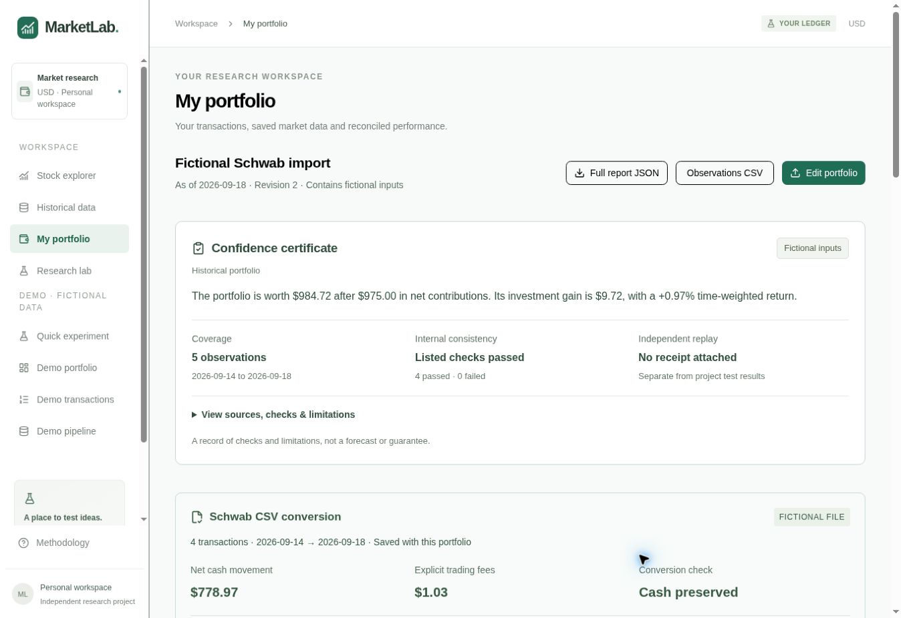

# Brokerage CSV import

Milestone 6 adds a TypeScript adapter for the Charles Schwab transaction-history
CSV. Users can upload the original supported export without renaming columns or
removing its account-title row. The existing MarketLab ledger format remains
available. This is file import, not an authenticated broker connection.

## Supported account and file

One complete USD cash-funded account, long-only stocks/ETFs, 1–500 transactions,
256 KiB maximum and at most ten symbols. Each held instrument still needs saved
unadjusted close prices and a declared complete corporate-action record.
Incomplete opening positions, multiple accounts, foreign currencies, shorting,
margin, options, bonds and unsupported activity are rejected.

The native header is:

```csv
Date,Action,Symbol,Description,Quantity,Price,Fees & Comm,Amount
```

Supported actions are `Buy`, `Sell`, `MoneyLink Deposit`, `MoneyLink Transfer`,
`Bank Transfer`, `Wire Funds Received`, `Wire Received`, `Funds Received`,
`Wire Sent` and `Funds Paid`. Cash transfers must have no security, shares, price
or fee, and directional labels must agree with their cash sign. Dividend,
interest, reinvestment, security transfer, split, journal and other actions stop
the entire import. The generic ledger's dividend-entitlement model does not make
unmapped broker dividend rows safe to import automatically.

The parser accepts MM/DD/YYYY dates, quoted fields and multiline descriptions,
BOM, CRLF, blank lines, empty trailing columns, dollar signs, thousands grouping
and parenthesized negatives. An optional native account-title preamble is
removed. A final `Transactions Total` must equal the exact net cash sum. Unknown
preambles, embedded totals and multiple account sections are rejected. Backdated
“as of” transaction dates are deliberately unsupported.

Compatibility references are the original
[beancount Schwab adapter](https://github.com/redstreet/beancount_reds_importers/blob/main/beancount_reds_importers/importers/schwab/schwab_csv_brokerage.py)
and [FINporterChuck's history fixtures](https://github.com/open-portfolio/FINporterChuck/blob/main/Tests/ChuckHistoryTests.swift).
They document observed export structure; they are not an official vendor schema
or a guarantee against future format changes. MarketLab's fixture is independently
written fictional data. No customer's actual brokerage export was supplied.

## Cash and ordering

`Amount` is authoritative net cash, and `Fees & Comm` is the explicit fee. Amounts
use BigInt cents; quantities and reported prices retain six decimals.

| Entry | Canonical gross consideration | Cash movement |
| --- | --- | --- |
| Buy | `−net cash − fee` | `−gross − fee` |
| Sell | `net cash + fee` | `gross − fee` |
| Deposit / withdrawal | Absolute net cash | Original signed net cash |

Displayed price × quantity can differ from the reported consideration because of
rounded execution prices. The conversion preserves cash and explicit fees,
counts these differences and shows a review notice; it never invents a fee or
silently adjusts the source amount. Excess precision and malformed grouping fail.

Dates run oldest to newest. The user explicitly confirms whether same-day rows
are newest first (reverse their order) or oldest first (preserve their order).
There are no intraday timestamps; the existing daily-close research convention
still applies, without settlement accounting. Insufficient cash or shares stop
preview. Repeated-looking executions remain separate source records. A repeated
identical complete file produces the same fingerprint and no new saved revision.
This is full-ledger replacement, not merging overlapping monthly statements.

## User flow and evidence

1. Prepare each symbol's price history and event coverage in Historical data.
2. Open My portfolio and upload the supported transaction-history CSV. Format
   detection and conversion run automatically; a single eligible price dataset
   can be selected automatically, subject to the user's confirmation.
3. Review source type, same-day order, net cash, fees, footer total, displayed-price
   differences and the converted entries. Resolve missing data or rejected rows.
4. Confirm the complete cash-funded history and instrument mappings, then preview.
5. Save only the reconciled preview. The server reparses the source CSV and checks
   its fingerprint and portfolio revision before replacing the saved ledger.

The receipt, normalized entries, frozen prices/events and confidence certificate
are saved together. Raw source CSV, account-title identifiers and free-text
descriptions are not persisted. JSON contains every converted entry and its
source record number. Observation CSV contains exact cent values and the
certificate, including the broker cash-reconciliation check. Editing the saved
normalized ledger is a manual import; re-upload the original file to preserve a
fresh broker conversion receipt. The file does not authenticate the broker or
prove complete history.

The built-in [fictional example](../public/examples/schwab-transactions.csv) uses
the existing XDEMO price fixture. It does not seed or alter a production account.
Expected results through September 18, 2026:

| Result | Expected |
| --- | ---: |
| Source transactions | 4 |
| Net cash / spendable cash | $778.97 |
| Explicit fees | $1.03 |
| Net contributions | $975.00 |
| Ending shares | 2 XDEMO |
| Holding value / remaining basis | $205.75 / $200.80 |
| Ending wealth | $984.72 |
| Realized / unrealized gain | $4.77 / $4.95 |
| Total gain | $9.72 |

## Acceptance checks and limits

- All 93 unit tests pass, including 13 brokerage cases. Tests cover cash/fee
  reconciliation, source syntax, incomplete funding, ordering, unsupported rows,
  duplicates, footer corruption, precision, bounds, rounded prices, receipt
  mutation, API draft validation and JSON/CSV serialization. Captured output:
  [brokerage-unit-tests.txt](evidence/brokerage-unit-tests.txt).
- Browser QA used an actual file-picker upload of the fictional fixture, automatic
  format detection and mapping, preview and save. The saved results match the
  table. Repeating the import preserved revision 2 and displayed “No duplicate
  created.” An unsupported Bank Interest row disabled preview/save and left the
  saved portfolio unchanged.
- A 390-pixel iframe provided a 375-pixel content viewport. The document's scroll
  width was 375 pixels with expanded conversion details; the table scrolls inside
  its card. This is layout QA, not physical-device or full accessibility testing.
- JSON/CSV serialization and replay through the canonical TypeScript engine
  passed. The browser download-event wait timed out in this session, so there is
  no fresh downloaded-file acceptance claim. No independent Python portfolio
  verifier exists; the UI continues to show “No receipt attached.”
- All browser writes were local fictional QA data. There is no production account
  import, authenticated broker feed, real-user adoption or new MongoDB staging
  evidence. The hosted app remains Workers + D1; the Node/MongoDB research service
  remains separate. No database migration or dependency change was needed.


