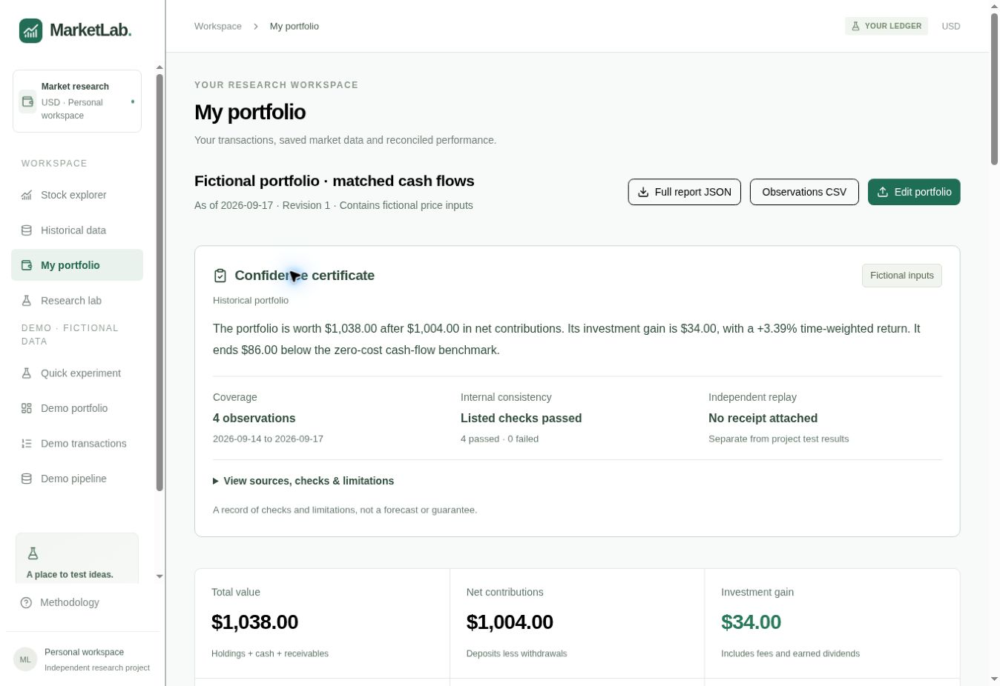
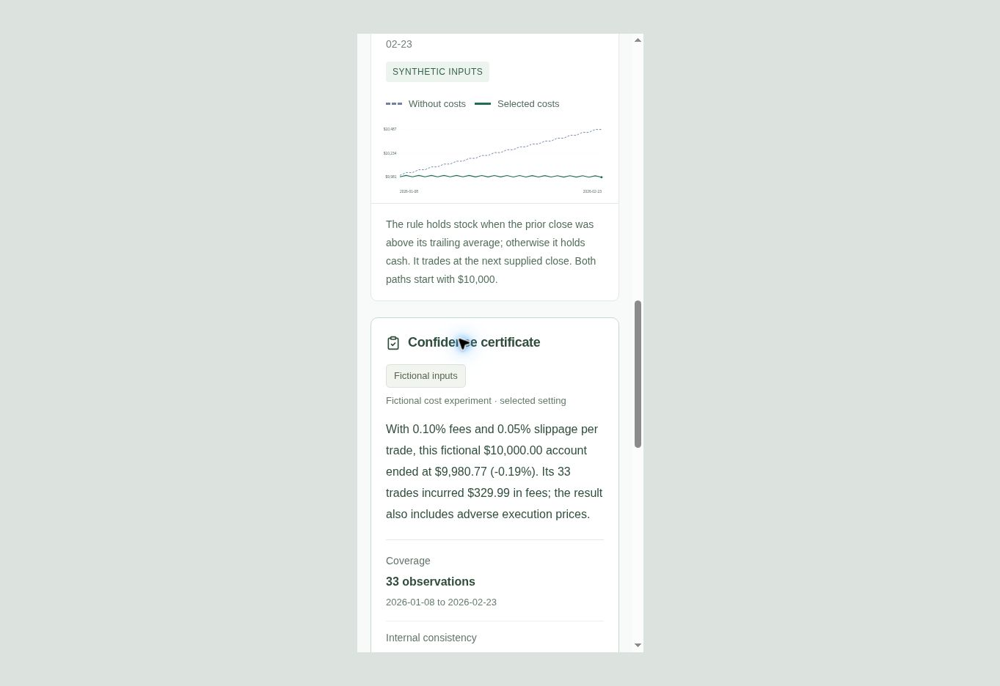

# Report confidence certificates

Milestone 5, September 26, 2026. Users need to understand a result's evidence
before relying on its headline number. Every analytical report now includes a
plain-language takeaway and a `marketlab-confidence-v1` certificate. It records
specific checks and remaining uncertainty; it is not a confidence percentage,
cryptographic signature, financial recommendation or forecast.

## Product behavior and report scope

| Report | Certificate location | Takeaway and checks |
| --- | --- | --- |
| Research lab | Saved report, unsaved preview, full JSON and observations CSV | Ending wealth/return versus selected benchmark; matched dates, exact wealth components, fee totals, signal timing and ending-return arithmetic |
| Quick experiment | Selected-cost result and downloadable JSON | Cost setting, ending wealth, return and fees; the same research consistency checks |
| Historical portfolio | Saved report, unsaved preview, full JSON and observations CSV | Wealth versus net contributions; exact gain/components, ledger fees/flows and optional benchmark alignment |
| Split/dividend analysis | Saved event analysis and JSON audit | Raw versus cash-inclusive change; supplied-date/event counts and endpoint/index consistency |
| Demo portfolio | Demo views and CSV report | Fictional account value/contributions/return; ledger totals and ending-position marks |
| Completed background job | Detailed service/CLI JSON export | Research consistency checks; existing native risk receipt remains separate |

Research screen certificates follow the chosen evaluation period. A **Full
report JSON** or **Observations CSV** still exports all evaluation segments and
its certificate explicitly describes the full period. Source observations,
event records and accounting inputs are unchanged. Raw dataset CSV and editable
transaction-ledger CSV are input interchange formats, not analytical reports;
their schemas are unchanged.

JSON reports add a `confidence` property without changing their existing report
format or snapshot fingerprint. Observation CSV reports append
`report_takeaway` and `confidence_certificate_json`. The first data row contains
those two values; remaining rows have empty cells, preserving a rectangular
table. Original columns and all observation values remain in their original
positions. The existing sectioned demo CSV adds labeled certificate rows.

## What the certificate establishes

The shared TypeScript builder derives source classification, date range,
observation count, longest calendar gap and an explicit list of checks from the
report itself. Each check is `passed`, `failed` or `not_run`. Failed checks replace
the optimistic numerical takeaway with an instruction to review the report.
Checks cover their stated arithmetic or structural condition only. They do not
replay the whole strategy or authenticate the source of a saved result.

Source cards distinguish declared historical data, fictional inputs and mixed
inputs. Provider connector provenance preserves its recorded refresh date and
timezone. Event sources and revisions are listed; event completeness remains
user-declared. A source label or content fingerprint is not a signature.

At the September 26 milestone, the independent Python check was **Not run / No
receipt attached**. The September 28 extension adds an owner-triggered replay
and receipt for an exact saved Research lab report. See
[independent replay](independent-replay.md). Reports without a matching stored
receipt still show no receipt; project tests and earlier offline QA downloads
never become individual report evidence. Existing C++ risk comparisons retain
their own limited scope, separate from independent accounting replay.

Assumptions describe execution timing, fees/slippage, rounding, dividends,
external flows and model exclusions as appropriate. Limitations explain that
exchange-session completeness, data authenticity and predictive skill have not
been established. No source attestation or receipt-upload feature was added.

## Implementation and acceptance evidence

| Path | Responsibility |
| --- | --- |
| `lib/finance/confidence.ts` | Shared certificate types, checks, takeaways and safe CSV metadata |
| `app/confidence-certificate.tsx` / `.css` | Readable summary, source cards and expandable evidence |
| `app/report-download.tsx` | Authenticated report retrieval, file preparation and visible failure state |
| `tests/unit/confidence.test.ts` | Eight financial/evidence/export regression cases |
| `scripts/test-python-parity.ts` | Certificate-bearing exports in the nine-report independent replay batch |
| `docs/evidence/confidence-export-checks.txt` | Actual browser export consistency results |

The local unit layer passes **80 tests**. The independent nine-report batch
passes **66,678 financial comparisons**. Type checking and lint pass. Actual
browser downloads reproduce the research, portfolio and event analyses; their
certificate objects match freshly derived certificates exactly. The actual
research and portfolio CSVs preserve every original observation field. Python
separately matched **1,575 fields** in the higher-cost demo download and **678
fields** in the saved research download. Its verifier does not certify the
certificate's prose or external sources.

Desktop QA covered the report views, unsaved previews, expandable details,
period/cost changes and all seven hosted export paths. Expanded details in a
390-pixel iframe had equal 375-pixel client/scroll widths. The temporary QA page
is removed before release. No new production data was created; Mongo recovery
tests, remote CI, physical phones and staging were not re-tested or activated.

The next ordered milestone is a real brokerage CSV import format.
