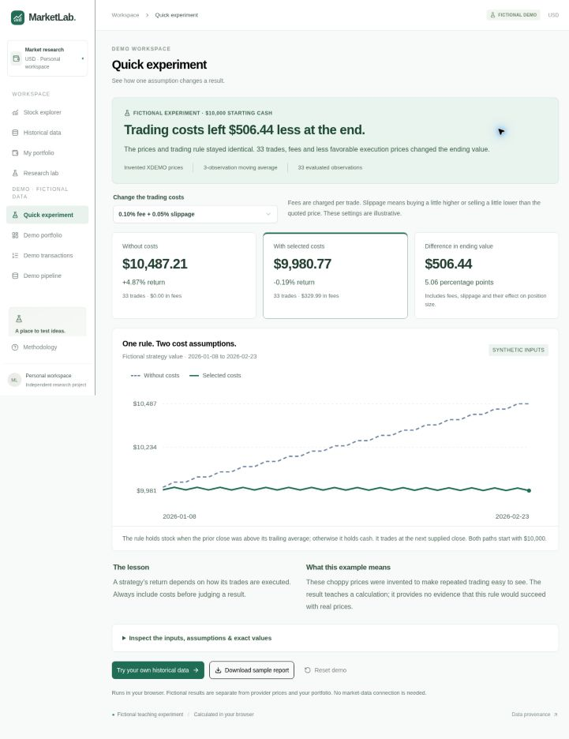
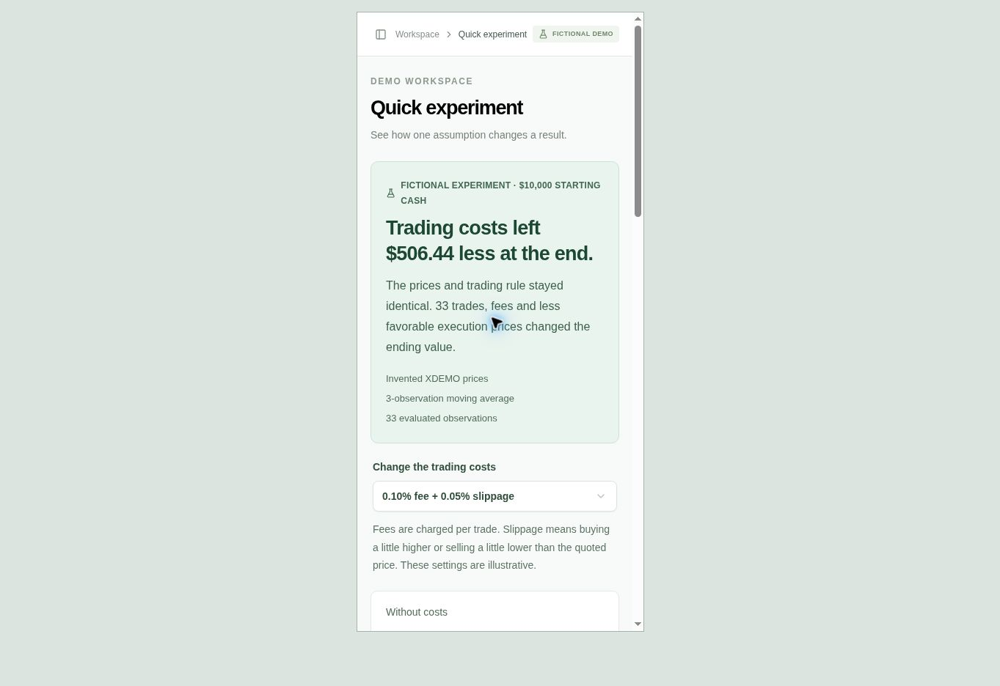

# One-click fictional experiment

Milestone 4, September 26, 2026. A first-time user can see a useful result without
finding prices, importing a file or choosing a strategy. On **Stock explorer** or
**Research lab**, click **Run sample experiment**. The **Quick experiment** menu
entry opens the same view.

The lesson is the effect of execution costs on the same trading rule and prices.
The three cost settings rerender calculated results, an equity curve and a
plain-language takeaway. Expand the evidence panel for assumptions and exact
observations; download the selected report or continue into Historical data.

## Frozen inputs and observed results

- Fixture: `trading-costs-demo-v1`, fictional XDEMO, raw USD closing prices.
- 36 invented weekday closes, January 5–February 23, 2026. Weekdays are not
  claimed to be exchange sessions. No splits or dividends exist by construction.
- Initial cash $10,000, a three-observation SMA and the canonical next-close
  execution model. Evaluation has 33 observations, January 8–February 23.
- The inputs deliberately alternate around the moving average to make frequent
  trading easy to see. They were not sampled or calibrated from real prices.

| Cost preset, per trade | Ending value | Return | Trade fees | Trades | Difference from zero costs |
| --- | ---: | ---: | ---: | ---: | ---: |
| No fees or slippage | $10,487.21 | +4.8721% | $0.00 | 33 | $0.00 |
| 0.10% fee + 0.05% slippage | $9,980.77 | −0.1923% | $329.99 | 33 | $506.44 |
| 0.25% fee + 0.15% slippage | $9,190.40 | −8.0960% | $791.77 | 33 | $1,296.81 |

Ending-value differences include fees, adverse fill prices and their effect on
affordable position sizes. They are not equal to the sum of explicit fees.
This example establishes no trading edge or expected real-world return.

## Implementation and reproduction

| File | Responsibility |
| --- | --- |
| `app/quick-demo.tsx` | Entry, calculated comparisons, chart, table and JSON download |
| `app/quick-demo.css` | Responsive layout and focus styling |
| `app/workspace.tsx` | Navigation and entry placement |
| `lib/finance/quick-demo.ts` | Fixed inputs and canonical engine invocation |
| `lib/finance/quick-demo-fingerprints.ts` | Generated identities for the fixed inputs |
| `scripts/update-demo-fingerprints.ts` | Regenerate identities after intentional input changes |
| `tests/unit/quick-demo.test.ts` | Input equivalence, fingerprints, cost outcomes and exports |
| `scripts/test-python-parity.ts` | Independent replay of all three presets |

All result values are computed when the demo opens. Only input fingerprints are
precomputed, allowing the fixed example to work when Web Crypto is unavailable.
Tests recompute those hashes and reject stale identities. After changing inputs,
run `node --experimental-strip-types scripts/update-demo-fingerprints.ts`, then
the unit and parity checks. Do not use fixed identities for user-supplied inputs.

The report uses `marketlab-research-v1` with complete snapshots, all three
evaluation segments and the existing assumptions. It explicitly includes
`demo.fictional: true` and `demo.savedToWorkspace: false`. Its fixed `created`
timestamp describes fixture metadata, not an actual database save. Downloading
creates a local file; the demo does not save transactions, datasets or reports.

```sh
pnpm test:unit
pnpm test:parity
python3 verification/python/verify_research.py marketlab-fictional-demo-illustrative.json
```

## Acceptance evidence

The desktop entry and a 390-pixel iframe entry each needed one click. Results
were observed in 1,294 ms and 282 ms respectively, including automation overhead.
These are local acceptance observations; they are not a performance benchmark,
production service metric or test on a physical phone. The narrow document
measured 375 pixels for both client width and scroll width.

Desktop checks covered all cost presets, reset, every table row, an actual JSON
download and continuation into Historical data. Python independently verified
the downloaded default report (1,575 fields). All three presets also participate
in the nine-report parity batch (66,678 fields). The unit suite passes 72 tests;
type checking and lint pass. See [verification.md](verification.md) for scope.





The temporary responsive-test HTML page is excluded from the released app.
Confidence certificates have since been added to the result and JSON download;
see [their scope and acceptance evidence](confidence-certificates.md). There is
still no remote GitHub CI run or staged Mongo service claim.
